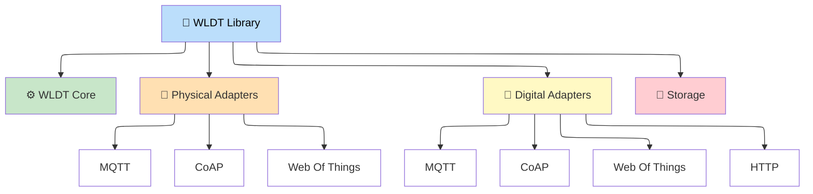

# 🏗️ White Label Digital Twins (WLDT) Library

The White Label Digital Twin (WLDT) 🏗️ library enables the creation of **Digital Twins (DTs)** as comprehensive software representations of real-world **Physical Assets (PAs)** or **Physical Twins (PTs)**. Designed specifically for **Internet of Things (IoT)** and **Industrial IoT (IIoT)** use cases, it powers **active DTs** that stay continuously connected to their physical counterparts. The library integrates properties, conditions, relationships, and behaviors through realistic models and data, ensuring a synchronized digital replica throughout the asset's full lifecycle.

Currently, the library is implemented in Java ☕ with some adapter modules in Kotlin, while Python 🐍 and C++ ports are under evaluation in the roadmap.

The official Website with the detailed documentation of the library and the entire project is available: [https://wldt.github.io/](https://wldt.github.io/)

## 🤖 Digital Twin Definition

A **Digital Twin (DT)** is a comprehensive software representation of an individual PA or PT in the real world. It captures the asset's properties, conditions, relationships, and behaviors via models and data, digitalizing its behavior in the deployed environment while reflecting its physical counterpart over time.

## 📡 WLDT Benefits

The WLDT library supports the **design, development, and deployment** of Digital Twins in IoT ecosystems. Designed based on the latest DT definitions from industrial and scientific domains, it treats DTs as **active, flexible, and scalable** software components. 

WLDT organizes its components into key categories for seamless IoT integration:  

- **WLDT Core ⚙️**: Central engine managing DT lifecycle, model and behavior definition, and execution. Developers can easily define DT behaviors while leveraging other library adapters and modules.
- **Physical Adapters 🔌**: Bridge real-world devices to DT (incoming data shadowing) through multiple protocols. Developers can contribute and create their own adapters and modules.
- **Digital Adapters 🔌**: Expose DT capabilities and data in the cyber space via multiple protocols. Developers can contribute and create their own adapters and modules. 
- **Storage 💾**: Persists DT state, models, and historical data.

## 🔌 Main Modules & Plugins

- **⚙️ WLDT Core:**
  - (Java) WLDT Core: [Link](https://github.com/wldt/wldt-core-java)
- **🔌 Physical Adapters:**
  - (Java) MQTT Physical Adater: [Link](https://github.com/wldt/mqtt-physical-adapter-java)
  - (Java) CoAP Physical Adapter: [Link](https://github.com/wldt/coap-physical-adapter-java)
  - [Kotlin] Web of Things Physical Adapter: [Link](https://github.com/wldt/wot-physical-adapter-kotlin)
- **🔌 Physical Adapters:**
  - (Java) MQTT Digital Adapter: [Link](https://github.com/wldt/mqtt-digital-adapter-java)
  - (Java) HTTP Digital Adapter: [Link](https://github.com/wldt/http-digital-adapter-java)
  - (Java) CoAP Digital Adapter: [Link](https://github.com/wldt/coap-digital-adapter-java)
  - (Kotlin) Web of Things Digital Adapter: [Link](https://github.com/wldt/wot-digital-adapter-kotlin) 
- **💾 Storage**: Storage modules will be releases soon :) 
